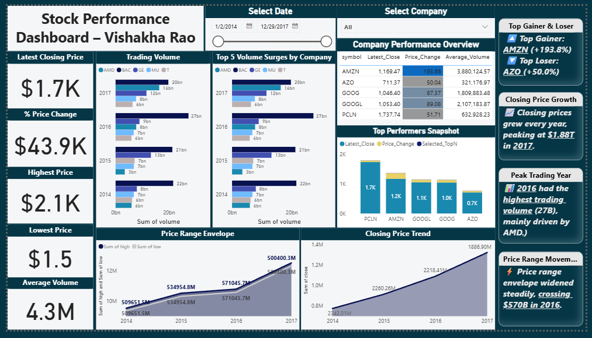

# 📈 Stock Price Time Series Analysis

This project explores stock price movements using Python and Power BI. It combines time series techniques with interactive dashboarding to uncover trends, volume surges, and company-level performance insights.

---

## 🧠 Techniques Used
- Moving averages and trend detection
- Time series visualization
- KPI breakdown and comparative analysis
- Dashboard storytelling

---

## 🛠 Tools & Technologies
- Python (pandas, matplotlib)
- Power BI Desktop

---

## 📄 Files Included
- `Stock_TimeSeries_Analysis.ipynb`: Python notebook for time series analysis
- `Stock_TimeSeries_Dashboard.pbix`: Power BI dashboard file
- `Stock_Performance_Dashboard_VishakhaRao_2025.png`: Dashboard screenshot preview

---

## 📊 Dashboard Highlights

The Power BI dashboard provides a business-ready view of stock performance across major companies:

- 📉 Closing price trends and trading volume analysis  
- 🚀 Top gainers and losers by percentage change  
- 🔍 Volume surges by company  
- 📈 Price range envelope and historical growth  
- 🧾 Company-level performance breakdown with KPIs  

---

## 📥 How to View the Dashboard

You can explore the dashboard in one of the following ways:

- **Open the Power BI file**:  
  👉 [`Download Stock_TimeSeries_Dashboard.pbix`](Stock_TimeSeries_Dashboard.pbix)  
  🔗 [Get Power BI Desktop](https://powerbi.microsoft.com/en-us/downloads/)

- **Or view the embedded screenshot**:  
  

---

## 📌 Summary

This project demonstrates how time series analysis and dashboarding can be combined to deliver actionable insights for financial decision-making. It’s a great example of blending technical analysis with visual storytelling.
